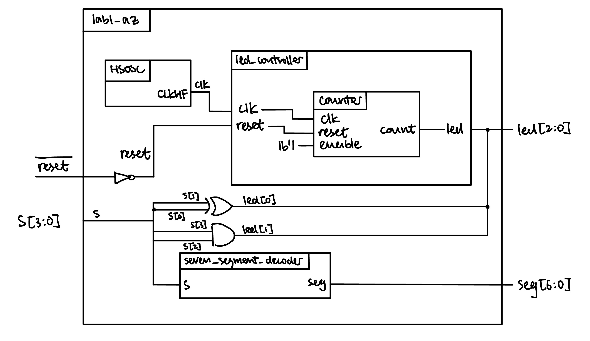
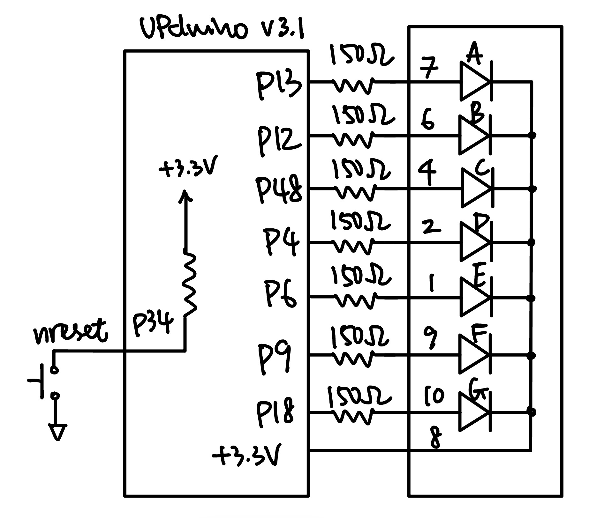
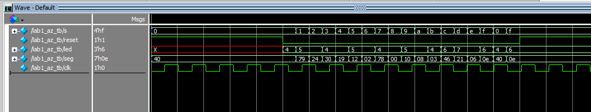
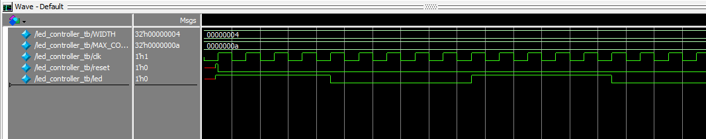
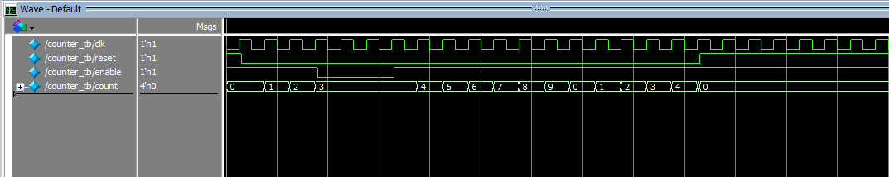
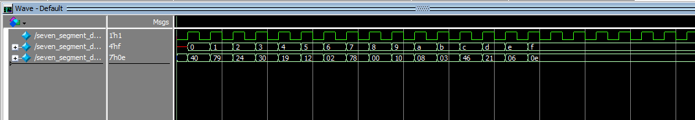

## Introduction

The goal of this lab was to assemble the E155 development board, confirm that both the
FPGA and MCU boards work, and write SystemVerilog to drive three LEDs and a seven-segment
display. The design reads four DIP switches `s[3:0]` and produces:

- `led[0]`: the XOR of `s[1]` and `s[0]`
- `led[1]`: the AND of `s[3]` and `s[2]`
- `led[2]`: a 2.4 Hz blink derived from the on-chip 48 MHz oscillator
- `seg[6:0]`: hexadecimal digit `0`–`F` selected by `s[3:0]`

## Design and Testing Methodology

The design is split into four modules so some of the modules are reusable in later labs:

- `lab1_az.sv`: top level module that instantiates the internal oscillator, led controller, and a switch-to-7-segment decoder, and drives three leds that represent the binary encoding of a hex number inputted by a switch.
- `led_controller.sv`: instantiates the counter, outputs a 2.4 Hz blink signal from a 48 MHz clock.
- `counter.sv`: a reusable counter that accepts parameters WIDTH and MAX_COUNT, and counts from 0 to MAX_COUNT-1 when enabled and wraps back to 0 when MAX_COUNT is reached.
- `seven_segment_decoder.sv`: a reusable, combinational decoder that maps the switch input to its respective 7-segment display format.

To toggle at 2.4 Hz the counter must roll over every half period, i.e. every 48 MHz ÷ (2 × 2.4 Hz) = 10,000,000 cycles, which needs a 24-bit counter:

Each submodule has its own stim/assert testbench:

- `seven_segment_decoder_tb.sv` exercies the decoder over all 16 input combinations.
- `counter_tb.sv` checks the counter module for correct reset, enable, and max count behaviors.
- `led_controller_tb.sv` checks the blinking led for correct reset, enable, and max count behaviors.
- `lab1_az_tb.sv` checks that the submodules are wired together correctly and that the switch-to-LED logic matches the truth tables.

## Technical Documentation

The source code for the project can be found in the associated [Github repository](https://github.com/AngelaZzzzz/hmc-e155-MicroPs/tree/main/lab/lab1/fpga/src/impl_1).

### Block Diagram

The block diagram in Figure 1 demonstrates the overall architecture of the design The top-level module `lab1_az` includes three submodules: the high-speed oscillator block (`HSOSC`), the led controller module (`led_controller`), and the 7 segment decoder (`seven_segment_decoder`). The led controller includes the counter module (`counter`). The assign logic for two of the three output LEDs are shown with the `XOR` and `AND` logic gates.

### Schematic
{width=60% fig-align="center"}

## Results and Discussion

DID YOU ACCOMPLISH ALL OF THE PRESRIBED TASKS? AS APPROPRIATE, HOW DID THE DESIGN PERFORM (HOW FAST/ACCURATE/RELIABLE WAS IT?)

All prescribed tasks are accomplished. On hardware, all 16 switch positions were stepped through to confirm the displayed digit, and the LED truth tables and blink rate were verified.

### Testbench Simulation

The design met all intended design objectives. 

## Conclusion

BRIEFLY SUMMARIZE WHAT WAS DONE AND HOW IT PERFORMED. ALSO NOTE HOW MANY HOURS YOU SPENT WORKING ON THE LAB

I spent a total of 18 hours working on this lab.

## AI Prototype Summary
