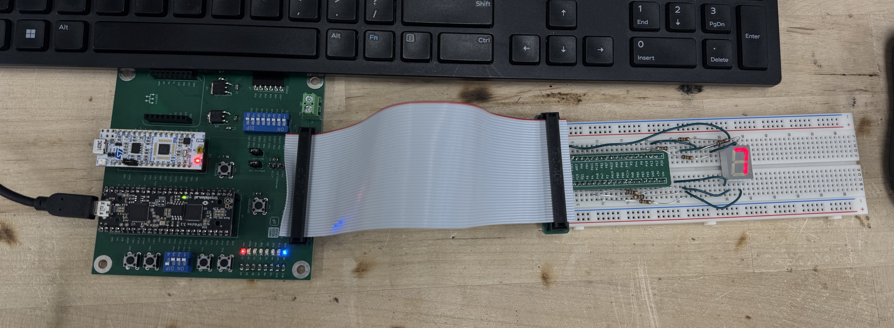
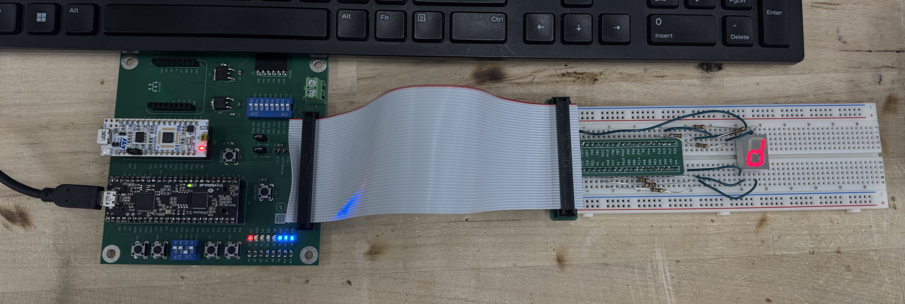

## Introduction

The goal of this lab was to assemble the E155 development board, confirm that both the
FPGA and MCU boards work, and write SystemVerilog code to drive three LEDs and a seven-segment display. The design reads four DIP switches `s[3:0]` and produces:

- `led[0]`: the XOR of `s[1]` and `s[0]`
- `led[1]`: the AND of `s[3]` and `s[2]`
- `led[2]`: a 2.4 Hz blink derived from the on-chip 48 MHz oscillator
- `seg[6:0]`: hexadecimal digit `0`–`F` selected by `s[3:0]`

## Design and Testing Methodology

The design is split into four modules so some of the modules are reusable in later labs:

- `lab1_az.sv`: top level module that instantiates the internal oscillator, led controller, and a switch-to-7-segment decoder, and drives three leds that represent the binary encoding of a hex number inputted by a switch.
- `led_controller.sv`: instantiates the counter, outputs a **2.4 Hz** blink signal from a 48 MHz clock.
- `counter.sv`: a reusable counter that accepts parameters WIDTH and MAX_COUNT, and counts from 0 to MAX_COUNT-1 when enabled and wraps back to 0 when MAX_COUNT is reached.
- `seven_segment_decoder.sv`: a reusable, combinational decoder that maps the switch input to its respective 7-segment display format.

:::{.callout-note collapse="true"}
## How did we get 2.4 Hz?

For the counter, we have set MAX_COUNT = $10,000,000$. This determines what the counter counts up to and therefore the output frequency, which in our case will also be the frequency at which `led[2]` blinks at. Because the on-chip oscillator oscillates at $48$ MHz, and since we toggles `led[2]` half way through each count cycle, the blink frequency will be $48$ MHz $÷$ $10,000,000$ cycles $÷$ $2 = 2.4$ Hz.
:::

Each submodule has its own stim/assert testbench:

- `seven_segment_decoder_tb.sv` exercies the decoder over all 16 input combinations.
- `counter_tb.sv` checks the counter module for correct reset, enable, and max count behaviors.
- `led_controller_tb.sv` checks the blinking led for correct reset, enable, and max count behaviors.
- `lab1_az_tb.sv` checks that the submodules are wired together correctly and that the switch-to-LED logic matches the truth tables.

## Technical Documentation

The source code for the project can be found in the associated [Github repository](https://github.com/AngelaZzzzz/hmc-e155-MicroPs/tree/main/lab/lab1/fpga/src/impl_1).

### Block Diagram


The block diagram in Figure 1 demonstrates the overall architecture of the design The top-level module `lab1_az` includes three submodules: the high-speed oscillator block (`HSOSC`), the led controller module (`led_controller`), and the 7 segment decoder (`seven_segment_decoder`). The led controller includes the counter module (`counter`). The assign logic for two of the three output LEDs are shown with the `XOR` and `AND` logic gates.

### Schematic
{width=60% fig-align="center"}

Figure 2 shows the physical layout of the design. Internal 100 k $\Omega$ pullup resistors were used to ensure the active low reset pin and the switches were not floating. This value was given by the lab instruction. Each of the 7 output segments were connected using a **150 $\Omega$** current-limiting resistor to ensure the output current did not exceed the safety range of ~8 mA.

:::{.callout-note collapse="true"}
## How did we get 150 $\Omega$?

From the 7-segment display datasheet, we obtained that the forward voltage per segment is typically $2$ V. We know that the common anode is connected to $3.3$ V, making the voltage drop across the resistor-LED segment combo $3.3 - 2 = 1.3$ V. Using Ohm's law and plugging in $I = 8$ mA, we obtain an optimal resistor value of $1.3$ V $÷$ $8$ mA $= 162.5$ $\Omega$. Since we don't have that resistor value in lab, we will use $150$ $\Omega$ instead. Double checking, $150$ $\Omega$ with a $1.3$ V voltage drop gives a current of $8.67$ mA, which is still safe.
:::


## Results and Discussion

DID YOU ACCOMPLISH ALL OF THE PRESRIBED TASKS? AS APPROPRIATE, HOW DID THE DESIGN PERFORM (HOW FAST/ACCURATE/RELIABLE WAS IT?)

### Testbench Simulation


Figure 3 shows a screenshot of the Questa simulation of the 7 segement decoder module. We tested across all 16 possible input combinations, as demonstrated in the second signal in the screenshot (`s`), with their respective output captured by the third signal in the screenshot (`seg`). All tests pass with no errors.

<details>
<summary>Other testbenches</summary>


Figure 4 shows a screenshot of the Questa simulation of the lab1_az top level module. All tests pass with no errors.


Figure 5 shows a screenshot of the Questa simulation of the led controller module. All tests pass with no errors


Figure 6 shows a screenshot of the Questa simulation of the counter module. All tests pass with no errors.

</details>

The design met all intended design objectives. 

### Hardware

All prescribed tasks are accomplished. On hardware, all 16 switch positions were stepped through to confirm the displayed digit, and the LED truth tables and blink rate were verified. Both the LED and the 7-segment display changes instantly when the switch input is changed.



As shown in Figure 7, when the switch is 0111 (hexadecimal 7), the 7-segment display correctly displays 7. And since `s[0] ^ s[1]` is 0, `s[2] & s[3]` is 0, neither of led[0] and led[1] are on. Led[2] is on since it is always blinking.

<details>
<summary>Another test case</summary>



As shown in Figure 8, when the switch is 1101 (hexadecimal D), the 7-segment display correctly displays d (lower-case to differentiate against 0). And since `s[0] ^ s[1]` is 1, `s[2] & s[3]` is 1, both led[0] and led[1] are on. Led[2] is also on since it is always blinking.

</details>

## Conclusion

The design successfully controlled 3 LEDs and a 7-segment display using a 4-bit switch input and the on-board high speed oscillator. The displays were all very successful. I spent a total of 20 hours working on this lab.

## AI Prototype Summary

Model used: **Gemini 3.6 Thinking**

### AI Chat Transcript

<details>
<summary>User Prompt</summary>

Write SystemVerilog HDL to leverage the internal high speed oscillator in the Lattice UP5K FPGA and blink an LED at 2 Hz. Take full advantage of SystemVerilog syntax, for example, using logic instead of wire and reg. 

</details>

<details>
<summary>AI Response</summary>

```
// Top-level module to blink an LED at 2 Hz using the iCE40 UltraPlus internal oscillator
module led_blinker_2hz (
    output logic led = 1'b0
);

    // Internal clock signal generated by the high-speed oscillator primitive
    logic clk_48m;

    // Instantiate Lattice iCE40 UP5K High-Speed Oscillator primitive (SB_HFOSC)
    // CLKHF_DIV configuration:
    //   "0b00" -> 48 MHz
    //   "0b01" -> 24 MHz
    //   "0b10" -> 12 MHz
    //   "0b11" ->  6 MHz
    SB_HFOSC #(
        .CLKHF_DIV("0b00")  // Configure oscillator output to 48 MHz
    ) hfosc_inst (
        .CLKHFPU(1'b1),     // Power up the oscillator (1 = active)
        .CLKHFEN(1'b1),     // Enable output clock signal (1 = active)
        .CLKHF(clk_48m)     // Clock output port
    );

    // Counter frequency math:
    // To achieve a 2 Hz blink rate (period = 0.5 s), the LED toggles twice per second (every 0.25 s).
    // Toggles every N cycles: N = f_clk / (2 * f_target) = 48,000,000 / (2 * 2) = 12,000,000
    localparam int CLK_FREQ_HZ    = 48_000_000;
    localparam int TARGET_FREQ_HZ = 2;
    localparam int TOGGLE_COUNT   = (CLK_FREQ_HZ / (2 * TARGET_FREQ_HZ)) - 1;

    // 24-bit counter required to reach 11,999,999 (2^24 = 16,777,216)
    logic [23:0] counter = '0;

    // Sequential counter and LED state toggle block
    always_ff @(posedge clk_48m) begin
        if (counter == TOGGLE_COUNT) begin
            counter <= '0;
            led     <= ~led;
        end else begin
            counter <= counter + 1'b1;
        end
    end

endmodule
```

Design Details & SystemVerilog Syntax
Lattice Primitive (SB_HFOSC): The SB_HFOSC primitive is the hard macro for the high-speed oscillator on iCE40 UltraPlus (UP5K) FPGAs. It outputs a nominal 48 MHz clock signal when .CLKHF_DIV("0b00") is selected. If using Lattice Radiant IP modules, this primitive may also be wrapped under the HSOSC component name.


logic Data Type: Replaces legacy wire and reg declarations, eliminating ambiguity between net and register types across internal signals and port declarations.


always_ff procedural block: Enforces register synthesis intent for sequential clock-driven logic.


localparam int and Literal formatting: Uses integer-typed constants with literal underscores (48_000_000) for clear clock arithmetic readability.


Fill literal ('0): SystemVerilog syntax to reset all bits of a vector without explicitly sizing 24'd0.

</details>

<details>
<summary>User Prompt</summary>

Your code failed to synthesize.

</details>

<details>
<summary>AI Response</summary>

The synthesis failure on the Lattice iCE40 UltraPlus (UP5K) is almost certainly caused by one of three issues specific to Lattice synthesis engines (LSE/Synplify Pro) or your chosen toolchain flow:

1. Toolchain Primitive Name Mismatch (SB_HFOSC vs. HSOSC)
Lattice Radiant: Uses the primitive name HSOSC. If you instantiate SB_HFOSC in Radiant, synthesis throws an unknown module error.


iCEcube2 / Yosys / Open-Source (nextpnr): Uses the primitive name SB_HFOSC.


2. Inline Port & Variable Initialization
Declarations like output logic led = 1'b0; or logic [23:0] counter = '0; are valid in SystemVerilog simulation, but many FPGA synthesizers (especially Lattice LSE) reject inline initializers on port declarations or variables. Initialization should be handled via an initial block (for power-up defaults) or an explicit reset signal.

3. Strict SystemVerilog Synthesizer Frontends
Certain LSE or older Synplify versions fail on unsized literals ('0) or typed local parameters (localparam int).

Universal, Synthesis-Safe SystemVerilog Code
For Open-Source (Yosys/nextpnr) or Lattice iCEcube2:

```
module led_blinker_2hz (
    output logic led
);

    logic clk_48m;

    // Hard primitive for iCEcube2 / Yosys open-source flow
    SB_HFOSC #(
        .CLKHF_DIV("0b00")  // 48 MHz output
    ) hfosc_inst (
        .CLKHFPU(1'b1),
        .CLKHFEN(1'b1),
        .CLKHF(clk_48m)
    );

    // 48 MHz / (2 * 2 Hz) = 12,000,000 cycles per toggle
    localparam [23:0] TOGGLE_COUNT = 24'd11_999_999;

    logic [23:0] counter;

    // Power-on state initialization for FPGA synthesis
    initial begin
        counter = 24'd0;
        led     = 1'b0;
    end

    always_ff @(posedge clk_48m) begin
        if (counter == TOGGLE_COUNT) begin
            counter <= 24'd0;
            led     <= ~led;
        end else begin
            counter <= counter + 1'b1;
        end
    end

endmodule
```

For Lattice Radiant:
If using Lattice Radiant, replace the primitive instantiation block above with HSOSC:

```
   // Hard primitive for Lattice Radiant software
    HSOSC #(
        .CLKHF_DIV("0b00")  // 48 MHz output
    ) hfosc_inst (
        .CLKHFPU(1'b1),
        .CLKHFEN(1'b1),
        .CLKHF(clk_48m)
    );
```

Synthesis Checklist
File Extension & Tool Settings: Ensure your file is saved as .sv (not .v). If using iCEcube2 or Radiant, ensure the tool project options are set to SystemVerilog mode rather than Verilog-2001.


Library Inclusions: If using Radiant, ensure the target family is set to iCE40UP so the HSOSC macro is visible to the synthesizer.

</details>

### Summary
