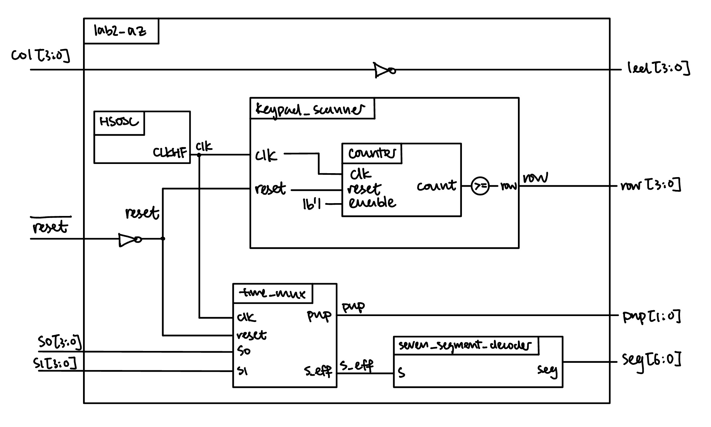
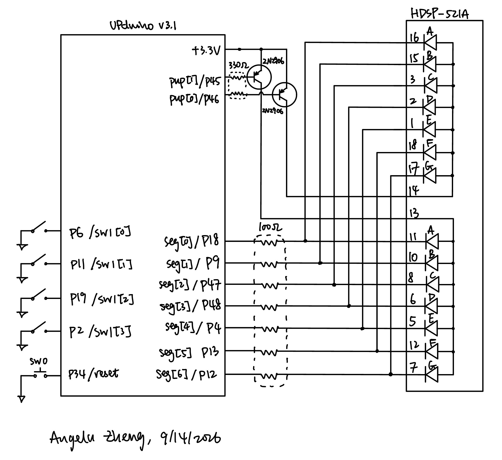
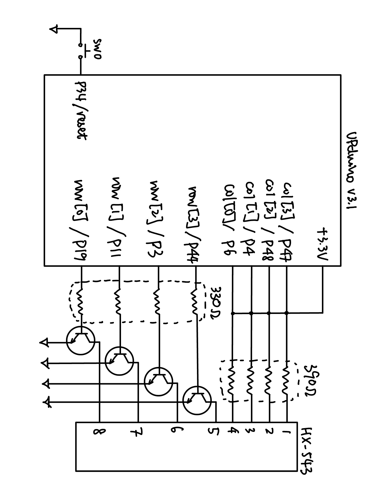
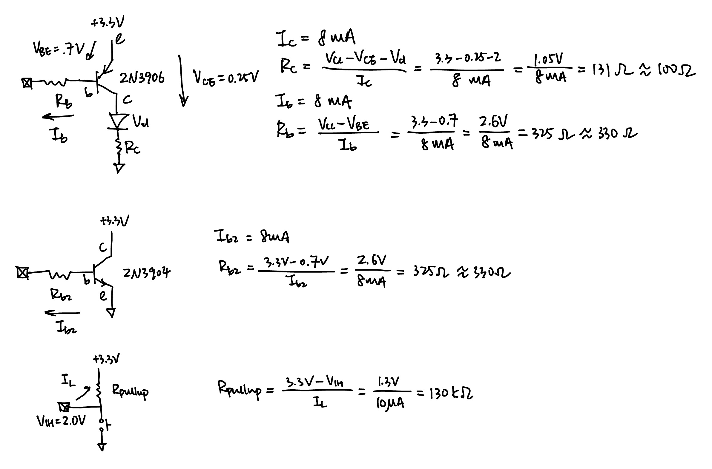
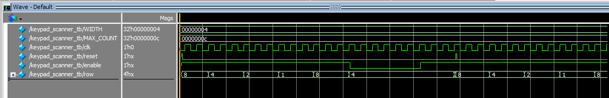
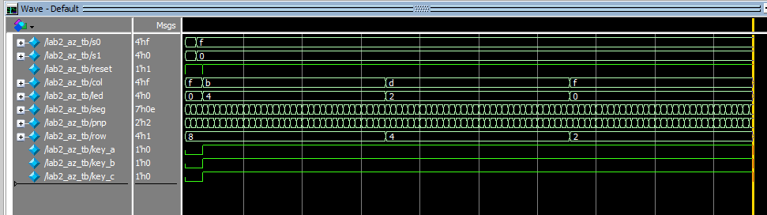
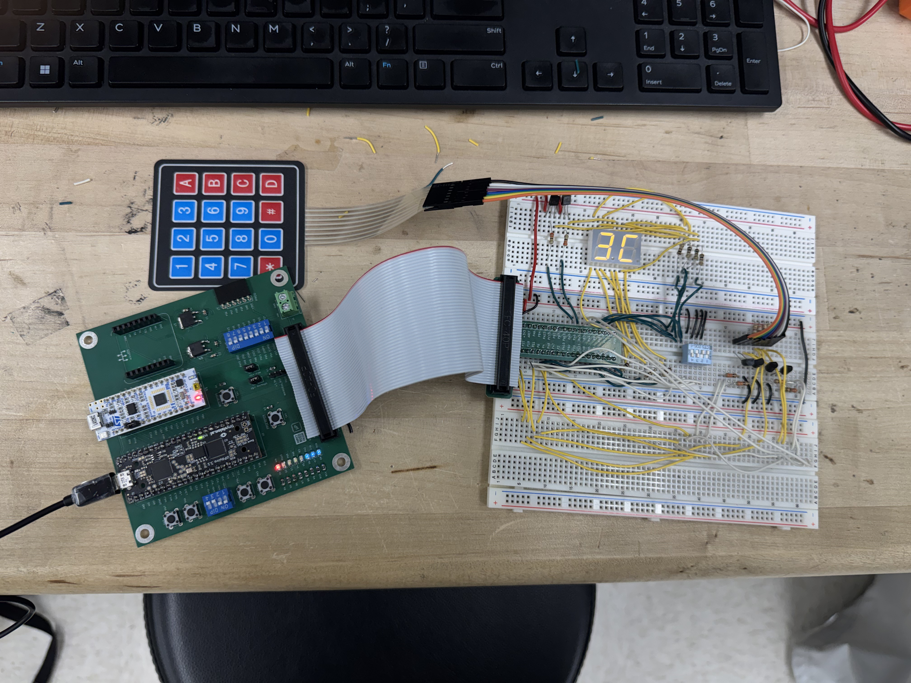
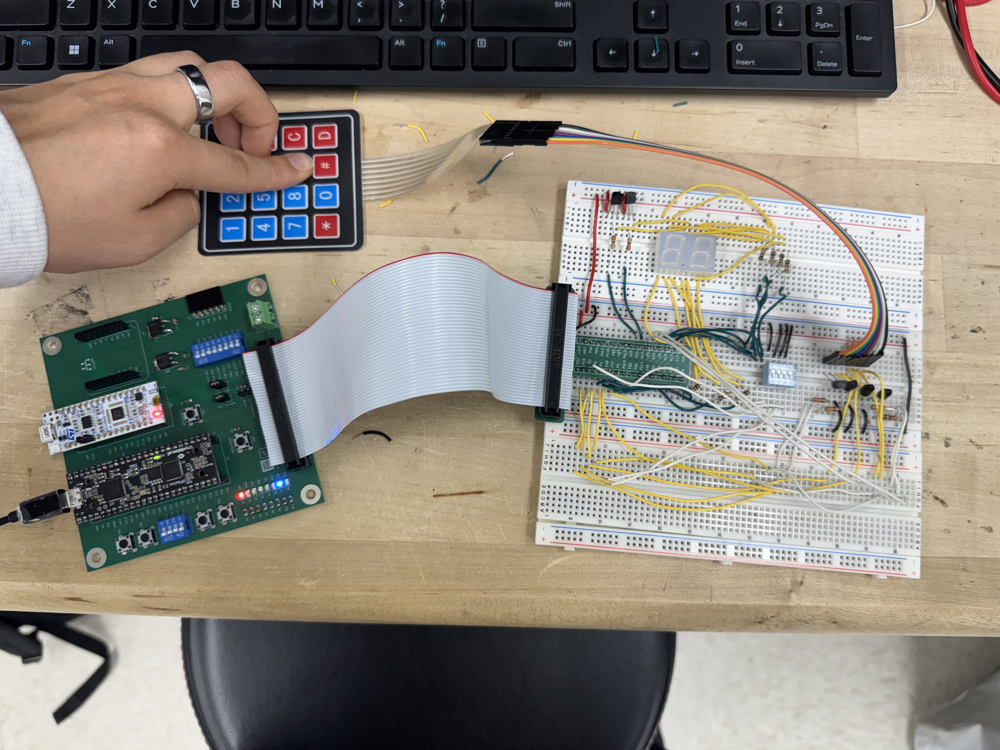

## Introduction

The goal of this lab was to use time multiplexing to share one expensive hardware resource across two jobs, and to interrogate a matrix keypad by scanning it one row at a time. The design reads two independent 4-bit switch inputs `s0[3:0]` and `s1[3:0]`, reads the four keypad columns `col[3:0]`, and produces:

- `seg[6:0]`: a single shared cathode bus, driven by **one** seven-segment decoder that alternates between the two digits
- `pnp[1:0]`: one-hot anode enables that turn on exactly one display at a time through 2N3906 PNP transistors
- `row[3:0]`: a rotating one-hot scan pattern driven onto the keypad rows through 2N3904 NPN transistors wired as open-collector outputs
- `led[3:0]`: the inverted keypad columns, so that pressing a key blinks the LED for that column

Because a single decoder and a single set of segment pins serve both digits, the display costs 9 FPGA pins instead of the 14 that two independent decoders would need.

## Design and Testing Methodology

The design is split into five modules, two of which are reused unchanged from lab 1:

- `lab2_az.sv`: top level module. It instantiates the internal oscillator (`HSOSC`), the time multiplexer (`time_mux`), the shared decoder (`seven_segment_decoder`), and the keypad row scanner (`keypad_scanner`), and contains a single assign statement that passes the keypad columns back out to the LEDs.
- `time_mux.sv`: a 2:1 multiplexer in front of the shared decoder. A counter divides the 48 MHz clock; the first half of each count period selects `s1` and the second half selects `s0`, and the matching anode enable in `pnp[1:0]` is asserted so that only the digit whose data is currently on the segment bus is lit.
- `keypad_scanner.sv`: the row scanner. A counter provides the state, and four assign statements convert the count into the rotating one-hot pattern `1000` → `0100` → `0010` → `0001`. The module is both resettable and enable-able, and it contains nothing other than the counter instance and the output assigns.
- `counter.sv`: Counter from lab 1.
- `seven_segment_decoder.sv`: Seven segement decoder from lab 1.

Per the simulation specifications, `counter` and `seven_segment_decoder` were not re-simulated, since both were verified with their own testbenches in lab 1 and neither was modified. The two new pieces of the design each have their own self-checking stim/assert testbench:

- `keypad_scanner_tb.sv` walks the scanner through all four output transitions (including the wrap from `0001` back to `1000`), checks that the output holds steady for a full row period rather than changing early, and checks the enable and reset features: the scanner freezes while `enable` is low, picks up where it left off when `enable` returns, and jumps back to `1000` when reset is asserted mid-scan.
- `lab2_az_tb.sv` exercises the top module. It models the keypad inside the testbench by driving `col` from the current `row` pattern and a set of simulated key presses, so the design under test sees the same behavior it would on the bench. It checks that reset selects a known digit, that each digit is held for exactly half the refresh period and then swaps, that the two digits follow their own switch inputs independently, and that the LED path lights the correct LED for the row currently being scanned. The multiple-keypress case is tested explicitly: three keys are held at once, two of them sharing a column, and each lights its LED only while its own row is being driven.

## Technical Documentation

The source code for the project can be found in the associated [Github repository](https://github.com/AngelaZzzzz/hmc-e155-MicroPs/tree/main/labs/lab2/src/impl_1).

### Block Diagram



The block diagram in Figure 1 shows the overall architecture of the design. The top-level module `lab2_az` contains four submodules: the high-speed oscillator block (`HSOSC`), the time multiplexer (`time_mux`), the shared seven-segment decoder (`seven_segment_decoder`), and the keypad row scanner (`keypad_scanner`). Both `time_mux` and `keypad_scanner` contain their own parametrized instance of the `counter` module. The single 4-bit net `s_eff` (s effective) carries the multiplexer output into the one decoder instance, which is what makes the decoder shared rather than duplicated, and the inverter on the `col` path is the only bare logic in the top module.

### Schematic

{width=70% fig-align="center"}

Figure 2 shows the physical layout of the dual seven-segment display design. Internal 100 k $\Omega$ pullup resistors were used to ensure the active low reset pin and the switches were not floating. Each pair of the 7 output segments were connected using a **100 $\Omega$** current-limiting resistor to ensure the FPGA output current did not exceed the safety range of ~8 mA.

{width=70% fig-align="center"}

Figure 3 shows the physical layout of the keypad design. Internal 100 k $\Omega$ pullup resistors were used to ensure the active low reset pin and the column pins were not floating. Each column is pulled up using a **390 $\Omega$** pull-up resistor, and each row are connected using a **330 $\Omega$** current-limiting resistor to ensure the FPGA output current did not exceed the safety range of ~8 mA.

### Calculations

{width=90% fig-align="center"}

## Results and Discussion

### Testbench Simulation



Figure 3 shows the Questa simulation of `keypad_scanner`. The `row` signal steps through `1000`, `0100`, `0010`, and `0001` and then wraps, holding each pattern for a full row period. The later part of the waveform shows the output frozen while `enable` is low and the jump back to `1000` when `reset` is asserted mid-scan. All tests pass with no errors.

<details>
<summary>Top module testbench</summary>



Figure 4 shows the Questa simulation of the `lab2_az` top level module. The `pnp` signal alternates between `01` and `10` while `seg` swaps between the two decoded digits in lockstep, confirming that the shared segment bus only ever presents the digit whose anode is enabled. Lower in the waveform, `led` follows `~col` as the scan walks across the rows with three keys held down. All tests pass with no errors.

</details>

### Hardware

The design met all of the intended design objectives. On hardware, both digits were stepped through all 16 values independently to confirm that each display follows its own DIP switch, and the keypad was checked key by key to confirm that each press blinks the LED for its column. The brightness of a digit does not change with the number of segments lit, there is no visible bleeding between the two digits, and neither digit flickers. Because the row drivers are open-collector, pressing two keys in the same column does not short two row drivers together, and the scanning signal keeps working correctly with at least two keys held at once.



As shown in Figure 7, switch 1 inputted a hex pattern of `3`, switch 2 inputted a hex pattern of `C`, and the dual seven-segment display correctly displays both. 

<details>
<summary>Keypad scanning on hardware</summary>



As shown in Figure 8, row 3 column 3 is depressed, and LED 3 correctly lights up.

</details>

## Conclusion

The design successfully drove two independent hexadecimal digits on a dual common-anode display from a single time-multiplexed seven-segment decoder, and successfully scanned a matrix keypad so that any keypress blinks the LED for its column. The most interesting part of the lab was that both of the hard problems were solved outside the HDL: the anode current and the multiple-keypress short each needed a transistor. 

I spent a total of 20 hours working on this lab.

## AI Prototype Summary

Model used: **Claude Fable 5.1**

### AI Chat Transcript

<details>
<summary>User Prompt</summary>

Write SystemVerilog HDL to time multiplex a single seven segment decoder (that decodes from four bits to a common anode seven segment display) to decode two sets of input bits and drive two sets of seven output bits.

</details>

<details>
<summary>AI Response</summary>

The file contains two modules: hex_to_7seg (the single combinational decoder, active-low for common anode) and tdm_seven_seg, which toggles a sel bit each clock, muxes din0/din1 into the one decoder, and latches the result into seg0 or seg1. Each output holds its value and refreshes every other cycle, so the displays never flicker even though only one decoder exists.

If you want a real chip-level multiplexed display (one shared segment bus plus per-digit anode enables) instead of two independent 7-bit outputs, that's a small variation — let me know.

```
// ---------------------------------------------------------------------------
// hex_to_7seg
//   Combinational 4-bit -> 7-segment decoder for a COMMON-ANODE display.
//   Segments are active-LOW (0 = lit).  Bit order: seg[6:0] = {g,f,e,d,c,b,a}
// ---------------------------------------------------------------------------
module hex_to_7seg (
    input  logic [3:0] bin,
    output logic [6:0] seg      // {g,f,e,d,c,b,a}, active low
);
    always_comb begin
        unique case (bin)      //        gfedcba
            4'h0: seg = 7'b1000000;
            4'h1: seg = 7'b1111001;
            4'h2: seg = 7'b0100100;
            4'h3: seg = 7'b0110000;
            4'h4: seg = 7'b0011001;
            4'h5: seg = 7'b0010010;
            4'h6: seg = 7'b0000010;
            4'h7: seg = 7'b1111000;
            4'h8: seg = 7'b0000000;
            4'h9: seg = 7'b0010000;
            4'hA: seg = 7'b0001000;
            4'hB: seg = 7'b0000011;
            4'hC: seg = 7'b1000110;
            4'hD: seg = 7'b0100001;
            4'hE: seg = 7'b0000110;
            4'hF: seg = 7'b0001110;
            default: seg = 7'b1111111;   // all off
        endcase
    end
endmodule


// ---------------------------------------------------------------------------
// tdm_seven_seg
//   Time-multiplexes ONE hex_to_7seg instance between two 4-bit inputs.
//   Each clock the mux alternates inputs; the decoder result is latched
//   into the matching output register, so both 7-bit outputs are held
//   continuously and each refreshes every other clock.
// ---------------------------------------------------------------------------
module tdm_seven_seg (
    input  logic       clk,
    input  logic       rst_n,      // async active-low reset
    input  logic [3:0] din0,
    input  logic [3:0] din1,
    output logic [6:0] seg0,       // decoded din0, active low
    output logic [6:0] seg1        // decoded din1, active low
);
    logic       sel;               // 0 -> din0 this cycle, 1 -> din1
    logic [3:0] bin_mux;
    logic [6:0] seg_dec;

    // Input mux feeding the single decoder
    assign bin_mux = sel ? din1 : din0;

    hex_to_7seg u_dec (
        .bin (bin_mux),
        .seg (seg_dec)
    );

    // Output demux: capture decoder result into the selected output register
    always_ff @(posedge clk or negedge rst_n) begin
        if (!rst_n) begin
            sel  <= 1'b0;
            seg0 <= 7'b1111111;    // blank on reset
            seg1 <= 7'b1111111;
        end else begin
            if (sel) seg1 <= seg_dec;
            else     seg0 <= seg_dec;
            sel <= ~sel;
        end
    end
endmodule
```

</details>

New chat with lab 1 files attached:

<details>
<summary>User Prompt</summary>

Write SystemVerilog HDL to time multiplex a single seven segment decoder (that decodes from four bits to a common anode seven segment display) to decode two sets of input bits and drive two sets of seven output bits. Use the seven segment decoder and oscillator provided in the attached files.

</details>

<details>
<summary>AI Response</summary>

How it works:

seven_segment_mux.sv — the multiplexer. Your counter module divides the clock; each time it wraps, a 1-bit digit register toggles. That bit selects which nibble (s0 or s1) feeds the single seven_segment_decoder instance, and on the output side routes the decoded pattern to seg0 or seg1 while blanking the other with 7'b1111111 (off for common anode). It also outputs active-low anode enables an0/an1, which you'll want if the two displays physically share segment lines and are switched through transistors — ignore them if your displays are fully separate.
lab_mux_top.sv — instantiates HSOSC exactly as in lab1_az.sv and the mux with MAX_COUNT = 240_000, so at 48 MHz each display refreshes at 100 Hz (well above the ~60 Hz flicker threshold). reset keeps your active-low pushbutton convention.
seven_segment_mux_tb.sv — same assert/$display style as your other testbenches, with a small MAX_COUNT so it runs fast. It checks the initial phase after reset, that outputs follow input changes immediately, and sweeps all 16 values through both displays.

You'll need to add s1[3:0], seg1[6:0], and the anode pins to pin_assignment.pdc for whatever sites you wire them to. Compile it alongside the unchanged counter.sv and seven_segment_decoder.sv.

```
// Purpose: Time multiplexes ONE seven_segment_decoder between two 4-bit inputs
//          (s0, s1) and drives two separate 7-bit common-anode segment outputs
//          (seg0, seg1).
//
//          A free-running counter (the provided counter module) toggles a
//          1-bit "digit" select every MAX_COUNT clock cycles. The select
//          chooses which input nibble is fed to the single decoder; the
//          decoder output is routed to the active display while the other
//          display is blanked (all 1's = off for common anode). The switching
//          is fast enough that both digits appear continuously lit.
//
//          an0 / an1 are active-LOW common-anode enables, provided in case
//          the two displays physically share segment wires and need their
//          anodes switched externally (e.g. via PNP transistors).
//
//          With a 48 MHz clock and MAX_COUNT = 240_000, each digit is
//          refreshed at 100 Hz (200 Hz toggle rate) -> no visible flicker.

module seven_segment_mux #(
	parameter WIDTH     = 18,
	parameter MAX_COUNT = 240_000
)(
	input	logic		clk,
	input	logic		reset,	// active high, asynchronous
	input	logic [3:0]	s0,		// value for display 0
	input	logic [3:0]	s1,		// value for display 1
	output	logic [6:0]	seg0,	// segments for display 0 (common anode)
	output	logic [6:0]	seg1,	// segments for display 1 (common anode)
	output	logic		an0,	// active-low anode enable, display 0
	output	logic		an1		// active-low anode enable, display 1
);

	localparam logic [6:0] BLANK = 7'b1111111;	// all segments off

	logic [WIDTH-1:0]	count;
	logic				digit;	// 0 -> display 0 active, 1 -> display 1 active
	logic [3:0]			s_sel;
	logic [6:0]			seg;

	// Refresh-rate divider (provided counter module)
	counter #(WIDTH, MAX_COUNT) refresh_counter(clk, reset, 1'b1, count);

	// Toggle the active digit each time the counter wraps
	always_ff @(posedge clk, posedge reset) begin
		if (reset)						digit <= 1'b0;
		else if (count == MAX_COUNT-1)	digit <= ~digit;
	end

	// Input multiplexer: pick which nibble goes to the single decoder
	assign s_sel = digit ? s1 : s0;

	// The single shared decoder
	seven_segment_decoder decoder(s_sel, seg);

	// Output demultiplexer: route decoded pattern to the active display,
	// blank the other one.
	assign seg0 = digit ? BLANK : seg;
	assign seg1 = digit ? seg   : BLANK;

	// Active-low anode enables
	assign an0 = digit;
	assign an1 = ~digit;

endmodule
```

```
// Purpose: Top level for the dual seven-segment display driver. Instantiates the
//          internal high-speed oscillator (48 MHz) and the time-multiplexed
//          seven-segment driver, which shares one decoder between two 4-bit
//          inputs and drives two 7-bit common-anode segment outputs.

module lab_mux_top(
	input	logic [3:0]	s0,		// switch input for display 0
	input	logic [3:0]	s1,		// switch input for display 1
	input	logic		reset,	// active-low pushbutton (same polarity as lab1_az)
	output	logic [6:0]	seg0,	// segments for display 0
	output	logic [6:0]	seg1,	// segments for display 1
	output	logic		an0,	// active-low anode enable, display 0
	output	logic		an1		// active-low anode enable, display 1
);

	logic clk;

	// Internal high-speed oscillator, 48 MHz (CLKHF_DIV default = "0b00")
	HSOSC hf_osc(.CLKHFPU(1'b1), .CLKHFEN(1'b1), .CLKHF(clk));

	// 48 MHz / 240_000 = 200 Hz digit toggle -> 100 Hz refresh per display
	seven_segment_mux #(18, 240_000) display_mux(
		.clk(clk),
		.reset(~reset),
		.s0(s0),
		.s1(s1),
		.seg0(seg0),
		.seg1(seg1),
		.an0(an0),
		.an1(an1)
	);

endmodule
```

```
`timescale 1 ns/1 ns

// Testbench for seven_segment_mux. Uses a small MAX_COUNT so the digit select
// toggles every 4 clock cycles and the whole sequence simulates quickly.

module seven_segment_mux_tb();
	logic		clk;
	logic		reset;
	logic [3:0]	s0, s1;
	logic [6:0]	seg0, seg1;
	logic		an0, an1;

	localparam MAX_COUNT = 4;

	seven_segment_mux #(3, MAX_COUNT) dut(clk, reset, s0, s1, seg0, seg1, an0, an1);

	// Reference decoder so the expected pattern comes from the same lookup table
	logic [3:0]	ref_in;
	logic [6:0]	ref_seg;
	seven_segment_decoder ref_dec(ref_in, ref_seg);

	// generate a clock
	always begin
		clk = 0; #5;
		clk = 1; #5;
	end

	// Check both outputs against the expected pattern for the active digit
	task check(input logic exp_digit);
		begin
			ref_in = exp_digit ? s1 : s0;
			#1;
			if (exp_digit == 0) begin
				assert (seg0 == ref_seg && seg1 == 7'b1111111 && an0 == 0 && an1 == 1)
					$display("PASSED! Display 0 shows %h, display 1 blanked at time: %0t.", s0, $time);
				else
					$error("FAILED! Display 0 active: seg0=%b seg1=%b an0=%b an1=%b at time: %0t.", seg0, seg1, an0, an1, $time);
			end else begin
				assert (seg1 == ref_seg && seg0 == 7'b1111111 && an1 == 0 && an0 == 1)
					$display("PASSED! Display 1 shows %h, display 0 blanked at time: %0t.", s1, $time);
				else
					$error("FAILED! Display 1 active: seg0=%b seg1=%b an0=%b an1=%b at time: %0t.", seg0, seg1, an0, an1, $time);
			end
		end
	endtask

	initial begin
		reset = 1;
		s0 = 4'h3;
		s1 = 4'hA;
		#22 reset = 0;

		// After reset, display 0 is active for MAX_COUNT cycles, then display 1
		@(negedge clk); check(0);
		repeat (MAX_COUNT) @(negedge clk);
		check(1);
		repeat (MAX_COUNT) @(negedge clk);
		check(0);

		// Change inputs mid-frame: outputs must follow immediately
		s0 = 4'h7;
		s1 = 4'hE;
		@(negedge clk); check(0);
		repeat (MAX_COUNT) @(negedge clk);
		check(1);

		// Sweep all 16 values through both displays
		for (int i = 0; i < 16; i++) begin
			s0 = i;
			s1 = 15 - i;
			repeat (MAX_COUNT) @(negedge clk);
			check(0);
			repeat (MAX_COUNT) @(negedge clk);
			check(1);
		end

		#100 $stop;
	end

endmodule
```

</details>

### Summary

The two attempts differed a lot in cost. Response 1 took around 20 seconds, while response 2, with my lab 1 files attached, took around 6 minutes.

Response 1 compiles and the code makes sense, and it used one syntax I haven't seen before: `unique case`. One difference is that it did not use the high speed oscillator because the instruction didn't tell it to, adding a little bit of resistance integrating it into our existing workflow. This is a caveat I notice in a lot of AI assisted implementations, where the user didn't include enough context resulting in an incomplete AI response.

Response 2 was much closer to what the lab instruction demands and what my code style is. Attaching my lab 1 files got the model to reuse my `counter` and `seven_segment_decoder` as well as having a template to go off of. However, again, it did not include the `counter` module, so it still requires some human processing before we can use the response on its own.