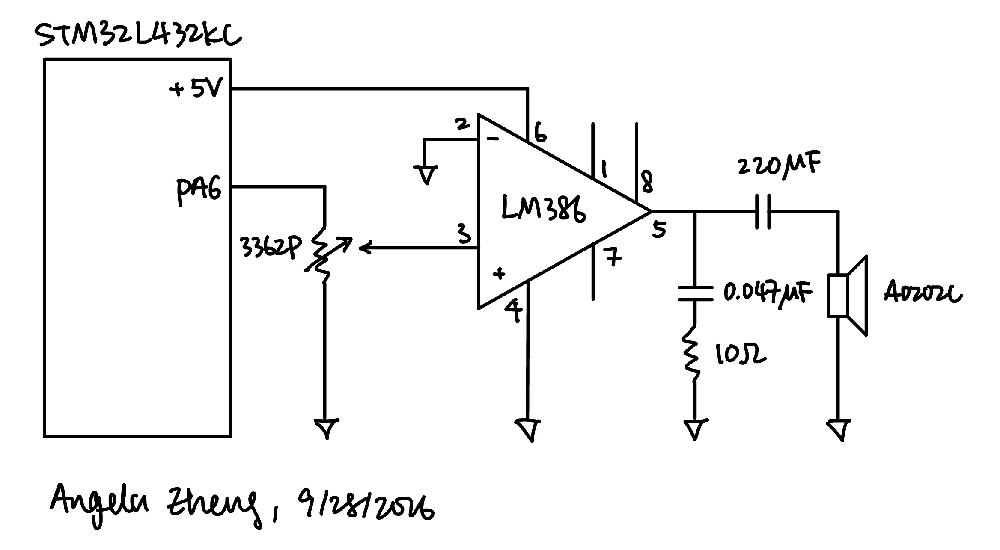
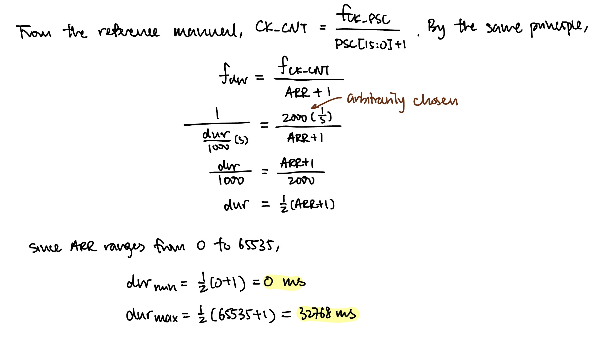
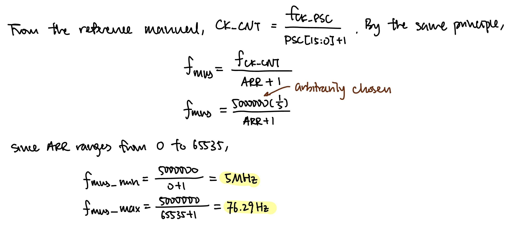
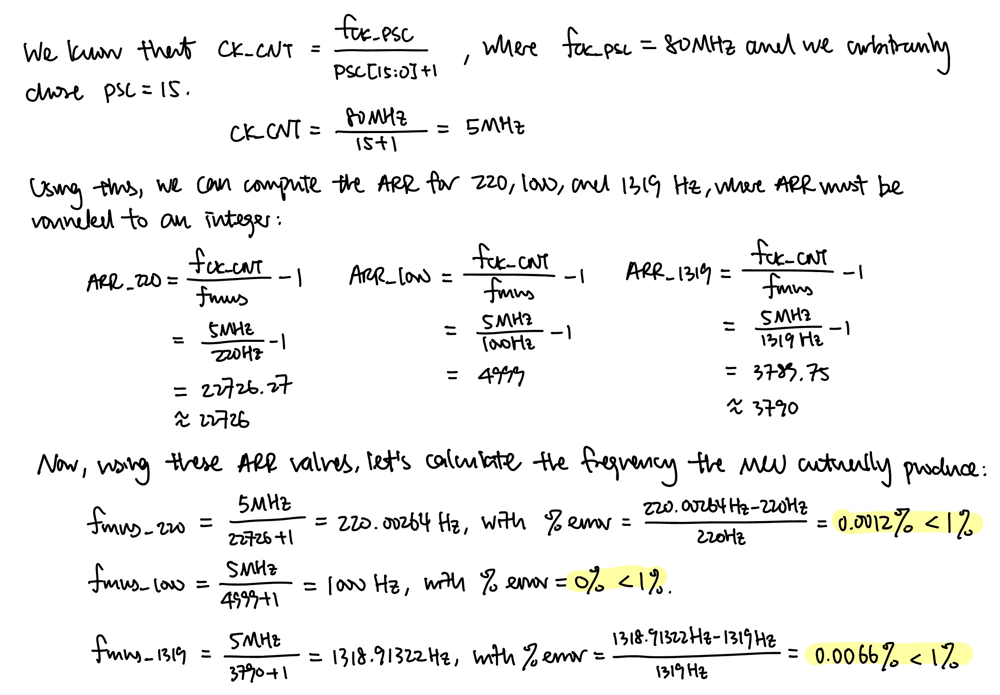

## Introduction

The goal of this lab was to play music on a speaker with the STM32L432KC microcontroller. The MCU walks through a score stored as an array of pitch (Hz) and duration (ms) pairs and generates a square wave at each pitch for the given duration. A pitch of 0 is a rest and a duration of 0 is end of the song. The square wave drives an LM386 audio amplifier, which in turn drives an 8 Ω speaker.

Two timer peripherals are used to generate the pitch and the duration:

- `TIM6`, a basic timer, is used as a blocking delay to time the duration of each note.
- `TIM16` generates the square wave in PWM mode at 50% duty cycle on `PA6`, providing the frequency of the note

## Design and Testing Methodology

The Für Elise notes mapping and some library source code are provided in [lab 4 source code](https://github.com/HMC-E155/hmc-e155/tree/main/lab/lab04), and [clock tutorial](https://github.com/HMC-E155/tutorial-clock-configuration/tree/solution/lib). The clock tutorial source code includes the RCC, GPIO, and FLASH configurations, where `configureClock()` runs the PLL from the 4 MHz MSI with M = 1, N = 80, R = 4, giving an 80 MHz system clock. Both timer buses run at 80 MHz, so that is the input to both prescalers.

### Duration timing with TIM6

`TIM6` is a 16-bit basic timer clocked from `APB1`. `PSC = 39999` gives 80 MHz / (39999 + 1) = **2 kHz**, i.e. one tick every 0.5 ms. Its `ARR` is then computed based on the input note duration (`dur`), where this timer waits until its internal counter reaches `ARR` and thus holds a note for `dur` duration this way.

### Pitch generation with TIM16

`TIM16` is a general purpose time clocked from `APB2`. `PSC = 15`, so the timer counts at 80 MHz / (15 + 1) = **5 MHz**. Its `ARR` is then computed based on the input music note frequency. This timer outputs a PWM wave to PA6, setting the pitch.

### Testing

The system was tested in three ways:

1. **MCU pin output:** `PA6` was probed directly to confirm that the output was a 0–3.3 V square wave at 50% duty cycle.
2. **Amplifier output:** A dummy 10 Ω resistor representing the speaker was attatched to the output. The voltage across it was measured, making sure that the current is within specs of the 8 Ω speaker.
3. **Audio:** Finally the speaker was connected and both songs were played, audibly checking pitch, tempo, rests, and whether the potentiometer changes the volume.

## Technical Documentation

The source code for the project can be found in the associated [Github repository](https://github.com/AngelaZzzzz/hmc-e155-MicroPs/tree/main/labs/lab4/src).

### Schematic

{width=90% fig-align="center"}

`PA6` drives the top of a **3362P 10 kΩ** potentiometer which feeds into the non-inverting input (pin 3) of the **LM386** audio amplifier, controlling volumn. The +5 V and ground connections to the amplifier come from the motherboard's power pins. There are no pull-up resistors to the MCU.

## Timer Calculations

### Duration
{width=90% fig-align="center"}

As shown in Figure 2, the minimum duration supported is **0 ms**, and the maximum duration supported is **32768 ms**, or 32.77 seconds.

### Pitch
{width=90% fig-align="center"}

As shown in Figure 3, the minimum frequency supported is **76.29 Hz**, and the maximum duration supported is **5 MHz**.

### Frequency Error
{width=90% fig-align="center"}

Checking only 220 Hz and 1000 Hz is not strictly sufficient as a proof, because the error increases with frequency since they require a more precise ARR to produce. Für Elise has a note at 1319 Hz, greater than both frequencies checked. Moreover, the prescaler value I chose makes frequency dividable by 5 MHz exactly percise, so checking 1000 Hz alone would not prove that all high frequency pitches are within error bounds. Thus, we also need to check the error bounds of 1319 Hz, which would suffice as proof that all frequencies that are not divisible by 5 MHz and lower than 1319 are within error bounds.

## Results and Discussion

### Hardware

The design meets all of the proficiency requirements and the excellence requirements. Für Elise plays at the tempo specified by the durations in the starter score, all rests are silent, and the LM386 drives the 8 Ω speaker through the AC-coupling capacitor. For excellence, the 3362P potentiometer gives volume control, and a second composition is added and plays after Für Elise.

On the software side, the design uses two timer peripherals accessed entirely through my own `#define` base addresses and register structs, and there are no division by zero errors.

## Conclusion

The system plays both songs correctly with accurate pitches and durations, using TIM16 in PWM mode for the tone and TIM6 as a millisecond delay. Both drivers were written from the reference manual with register structs and no CMSIS. Every pitch in Für Elise is reproduced within 0.007% error, well inside the 1% requirement, and the supported range of 76 Hz to 50 kHz and 0 ms to 32.77 s covers the notes with a lot of room to spare.

I spent a total of 15 hours working on this lab.

## AI Prototype Summary

Model used: **Claude Haiku 4.5**

### AI Chat Transcript

<details>
<summary>User Prompt</summary>

What timers should I use on the STM32L432KC to generate frequencies ranging from 220Hz to 1kHz? What’s the best choice of timer if I want to easily connect it to a GPIO pin? What formulae are relevant, and what registers need to be set to configure them properly?

</details>

<details>
<summary>AI Response</summary>

I'll search for the STM32L432KC datasheet and reference manual to give you accurate information about its timers and configuration.Now let me get the reference manual for detailed register configurations:Let me get the actual reference manual with register details:Perfect! Now I have comprehensive information. Let me create a detailed guide covering timer selection, formulas, and register configuration for your frequency range.

Timer Selection for 220 Hz – 1 kHz on STM32L432KC

The STM32L432KC features one advanced-control timer (TIM1), one 32-bit general-purpose timer (TIM2), and two 16-bit general-purpose timers (TIM15, TIM16).

Best Choice for GPIO Connection

**TIM1 (Advanced-Control Timer)** or **TIM2 (General-Purpose Timer)** are your best options. TIM1 is ideal if you want complementary PWM outputs, but **TIM2** is often simpler because:
- It's a full-featured general-purpose timer with 4 independent channels
- Each channel can output to a GPIO pin
- Simpler configuration than TIM1 (no complementary outputs or break signals to manage)
- TIM2 has a 32-bit auto-reload up/down counter and 32-bit prescaler

**TIM15/TIM16** would work but are mid-range options with fewer channels.

 Key Formulas

The frequency you generate depends on:

**f_output = f_timer / (ARR + 1)**

Where:
- **f_output** = desired output frequency (220 Hz to 1 kHz)
- **f_timer** = timer clock frequency after prescaler
- **ARR** = Auto-Reload Register value

The timer clock is divided by the prescaler:

**f_timer = f_clock / (PSC + 1)**

Where:
- **f_clock** = input clock (typically 80 MHz for STM32L432KC in run mode)
- **PSC** = Prescaler Register value

**Combining them:**

**f_output = f_clock / ((PSC + 1) × (ARR + 1))**

For **50% duty cycle (square wave):** CCRx = ARR / 2

Example Calculation

To generate **1 kHz** with 80 MHz clock:

1. Choose PSC = 79 → f_timer = 80 MHz / 80 = 1 MHz
2. Calculate ARR: ARR = (1 MHz / 1 kHz) - 1 = **999**
3. Set CCR1 = 499 for 50% duty (999 / 2)

To generate **220 Hz**:

1. Use PSC = 99 → f_timer = 80 MHz / 100 = 800 kHz
2. Calculate ARR: ARR = (800 kHz / 220 Hz) - 1 ≈ **3636**
3. Set CCR1 = 1818 for 50% duty

Register Configuration
1. Enable Clock (in RCC)

```c
RCC->APB1ENR1 |= RCC_APB1ENR1_TIM2EN;  // Enable TIM2 clock
// OR for TIM1:
RCC->APB2ENR |= RCC_APB2ENR_TIM1EN;    // Enable TIM1 clock
```

2. Configure GPIO for Alternate Function

For **TIM2_CH1 on PA5** (check your datasheet for pin mapping):

```c
// Enable GPIO clock
RCC->AHB2ENR |= RCC_AHB2ENR_GPIOAEN;

// Set PA5 to alternate function (TIM2_CH1)
GPIOA->MODER &= ~(3 << 10);     // Clear bits for PA5
GPIOA->MODER |= (2 << 10);      // Set to alternate function (10)

GPIOA->AFR[0] &= ~(0xF << 20);  // Clear AFR bits for PA5
GPIOA->AFR[0] |= (1 << 20);     // Set to AF1 (TIM2_CH1)
```

3. Configure Timer Registers

```c
// Prescaler: divides input clock
TIM2->PSC = 79;  // 80 MHz / 80 = 1 MHz

// Auto-reload register: defines period
TIM2->ARR = 999;  // 1 MHz / 1000 = 1 kHz

// Capture/Compare register: defines duty cycle
TIM2->CCR1 = 499;  // 50% duty: CCR1 = ARR/2

// Output compare mode 1 register (CCMR1)
TIM2->CCMR1 &= ~(0x7 << 4);  // Clear OC1M bits
TIM2->CCMR1 |= (0x6 << 4);   // Set to PWM Mode 1 (110)
TIM2->CCMR1 |= (1 << 3);     // OC1PE: Output compare preload enable

// Capture/Compare Enable Register (CCER)
TIM2->CCER &= ~(1 << 1);     // Clear CC1P: active high
TIM2->CCER |= (1 << 0);      // CC1E: enable channel 1 output

// Control Register 1 (CR1)
TIM2->CR1 |= (1 << 7);       // ARPE: auto-reload preload enable
TIM2->CR1 &= ~(1 << 0);      // CMS: edge-aligned mode (00)
TIM2->CR1 &= ~(1 << 4);      // DIR: up-counting

// Event Generation Register: generate update event
TIM2->EGR |= (1 << 0);       // UG: update generation

// Enable counter
TIM2->CR1 |= (1 << 0);       // CEN: counter enable
```
Key Registers Summary

| Register | Purpose | Relevant Bits |
|----------|---------|---------------|
| **TIMx_CR1** | Control Register 1 | CEN (0), DIR (4), CMS (5:6), ARPE (7) |
| **TIMx_CCMR1** | Capture/Compare Mode Register 1 | OC1M (6:4), OC1PE (3) |
| **TIMx_CCER** | Capture/Compare Enable Register | CC1E (0), CC1P (1) |
| **TIMx_PSC** | Prescaler | Divides input clock |
| **TIMx_ARR** | Auto-Reload Register | Sets period (frequency) |
| **TIMx_CCR1** | Capture/Compare Register 1 | Sets duty cycle / pulse width |
| **TIMx_EGR** | Event Generation Register | UG (0) triggers update |

Validation Checklist

✓ Clock enabled in RCC (TIMxEN bit)  
✓ GPIO configured as alternate function with correct AF number  
✓ PSC and ARR set for desired frequency  
✓ CCMR1 set to PWM Mode 1 (bits 6:4 = 110)  
✓ CCER enable bit (CC1E) set  
✓ ARPE bit set in CR1 for buffered ARR updates  
✓ Counter enabled (CEN bit in CR1)  

This configuration gives you clean frequency output from 220 Hz to 1 kHz with direct GPIO pin connection.

</details>

### Summary

The AI response was actually quite accurate. Moreover, given that the reference manual was 1600 pages and took me hours to read, AI was much faster, taking less than one minute. However, I definitely learned much more from navigating the reference manual and struggling to find information than having all the info readily presented to me. In terms of timer choice, AI chose to use TIM2 while I chose to use TIM6 and TIM16. Moreover, it changes the prescaler to change the internal clock frequency, where I changed ARR, which is simpler and gives better resolution. Overall, AI is definitely better at reading long documents than human. However, its ability to accurately capture every little detail across a long document still needs to be studied.
