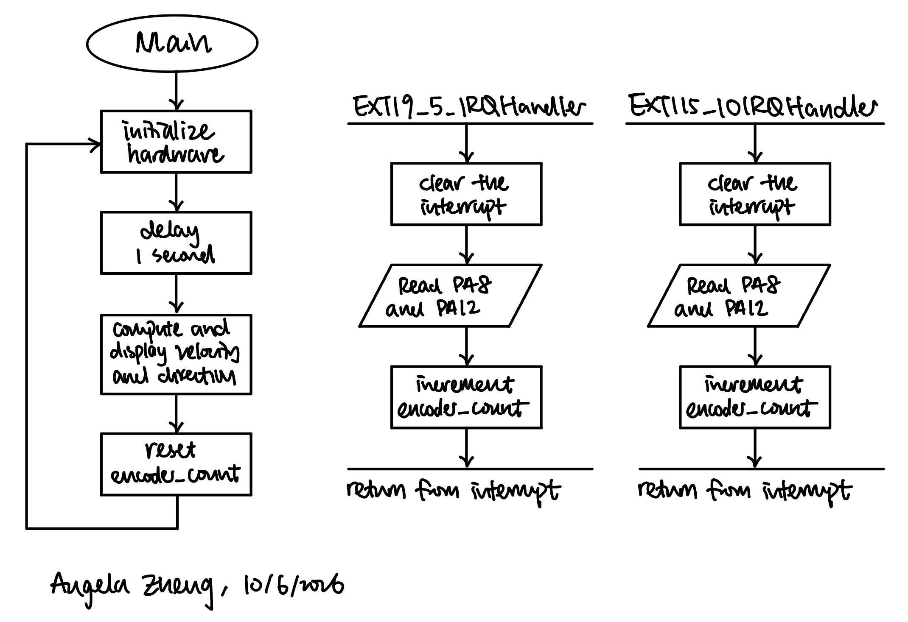
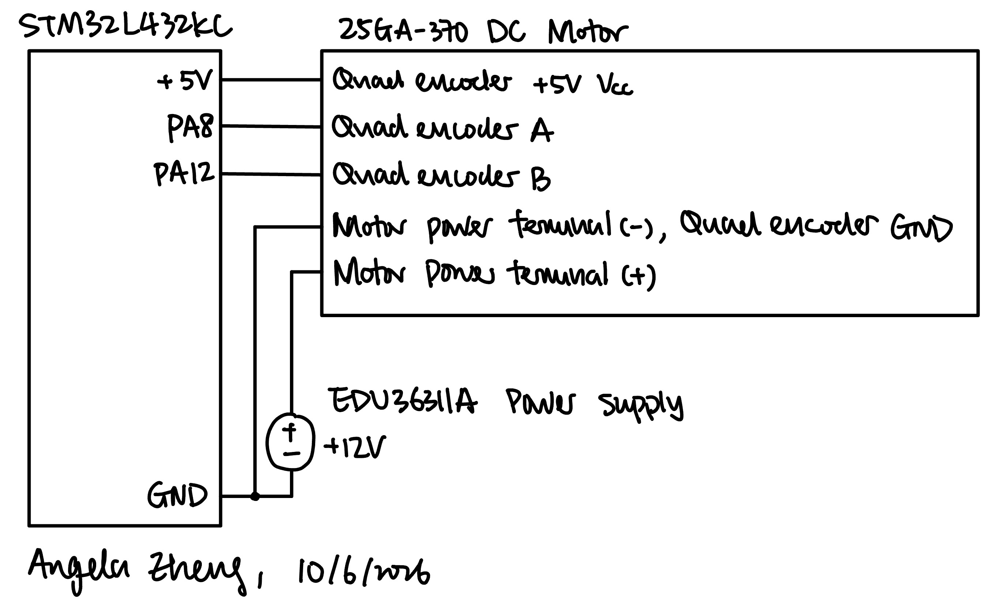
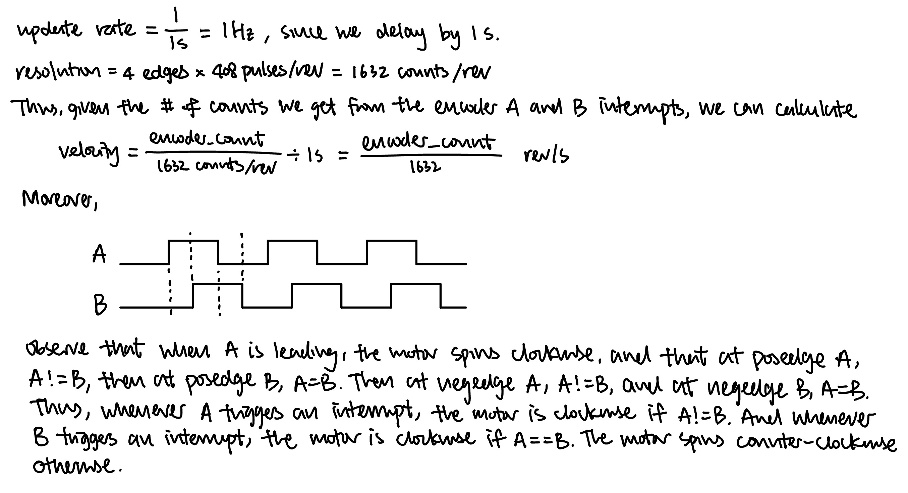
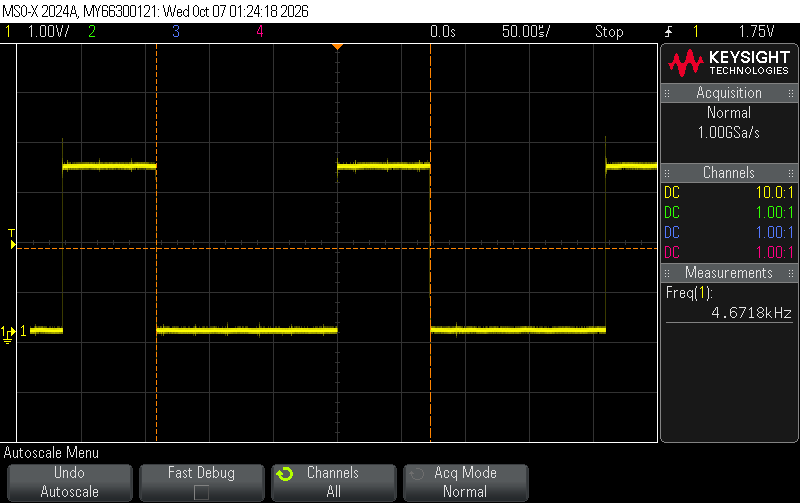

## Introduction

The goal of this lab was to measure the angular velocity and direction of a DC motor using the STM32L432KC microcontroller and a quadrature encoder. The encoder has two hall effect sensors, A and B, that output square waves 90° out of phase as the motor spins. The MCU uses external interrupts (EXTI) to count every rising and falling edge of both channels, and converts that count into angular velocity in rev/s and a direction every second, and prints it to the Segger debug terminal.

The motor used in lab has an encoder with 408 pulses per revolution (PPR) and spins at approximately 2.5 rev/s when 12 V is applied.

## Design and Testing Methodology

The GPIO, RCC, and TIM library files are adapted from the [interrupt tutorial](https://github.com/HMC-E155/tutorial-interrupts/tree/solution), and printing to the terminal follows the printf-without-UART tutorial linked in the lab description.

### Encoder inputs

Encoder channel A is connected to `PA8` and channel B to `PA12`. The encoder uses 5 V, so both pins were chosen from the 5 V tolerant (FT) pins listed in Tables 13–14 of the STM32L432KC datasheet. Both pins are configured as GPIO inputs with the MCU's internal pull-up resistors enabled.

### Interrupt configuration

Each encoder interrupt is configured as follows:

1. Enable the SYSCFG clock in `RCC_APB2ENR`.
2. Select port A for EXTI8 and EXTI12 in `SYSCFG_EXTICR3` and `SYSCFG_EXTICR4`.
3. Unmask lines 8 and 12 in `EXTI_IMR1`.
4. Enable both rising and falling edge triggers on both lines in `EXTI_RTSR1` and `EXTI_FTSR1`.
5. Enable `EXTI9_5` (IRQ 23) and `EXTI15_10` (IRQ 40) in the NVIC.

### Testing

The system was tested in three ways:

1. 12 V was applied to the motor and the printed velocity was compared against the expected ~2.5 rev/s
2. The motor supply was reversed and the printed direction and sign of the velocity were checked to flip.
3. The motor was turned off to verify a reading of 0 rev/s, and ran at low supply voltage to verify a small non-zero velocity.

## Technical Documentation

The source code for the project can be found in the associated [Github repository](https://github.com/AngelaZzzzz/hmc-e155-MicroPs/tree/main/labs/lab5/).

### Flowchart

{width=90% fig-align="center"}

The main loop and the two interrupt handlers communicate through the `encoder_count`. The handlers updates the count on every interrupt and the main loop reads and clears the count once per second.

### Schematic

{width=90% fig-align="center"}

The motor is powered from an external 12 V supply, and the encoder is powered from the 5 V and GND pins of the MCU, and the encoder A and encoder B outputs are connected to pins `PA8` and `PA12` on the MCU. The internal pull-up resistors on `PA8` and `PA12` are enabled in software.

## Calculations

{width=90% fig-align="center"}

Notice that since every edge of both channels triggers an interrupt, the design gets 4 counts per encoder pulse (4× decoding), or 4 × 408 = **1632 counts per revolution**, the highest resolution possible with this encoder.

## Interrupts vs. Manual Polling

Experiment Data & Explanation

To compare the two approaches, I setup `PA6` as a timing signal and probed it on the oscope. In the interrupt version, the pin toggles every time an interrupt is handled. In the polling version, the main loop toggles the pin once per iteration, with a `printf()` of both encoder pins in between to represent the other work a real main loop has to do.

{width=90% fig-align="center"}

As shown in Figure 4, with the motor at ~2.5 rev/s the pin toggles at ~4.67 kHz. Since the handlers only run when an interrupt occurs, the main loop can execute other instructions such as `printf()` without affecting the count.

{width=90% fig-align="center"}

{width=90% fig-align="center"}

For polling, the polling rate is set by how long one loop iteration takes. If the loop contains other instructions such as a `printf()`, the polling rate will decrease. Figure 5 and Figure 6 are the polling rate with one and two `printf()`s, respecively, and we can see that it decreased significantly when the loop has other instructions to execute. Moreover, for polling to not miss any edges, the loop must read the pins at least once between every two consecutive edges, which is at risk of losing edges for high speed input signals.

The tradeoff is that interrupts are a bit more complicated to implement, and at extremely high rates the interrupts could arrive faster than the handler can finish. However, this limit is set by the time the handler takes instead of other instructions in the polling loop, which is a bigger problem. Thus, the interrupt-based design is the better choice.

## Results and Discussion
With 12 V applied, the debug terminal reported a velocity of ~2.7 rev/s, which is close to the expected ~2.5 rev/s. Reversing the motor leads flipped the reported direction. With the motor off the system reported 0 rev/s, and when turned slowly the system still reported a small non-zero velocity.

The design meets all of the proficiency requirements and the excellence requirements. The system uses both edges of both encoder channels for the maximum 1632 counts per revolution, does not miss pulses at high speed, and still reports a non-zero velocity at low speeds.

## Conclusion

The system measures the speed and direction of the motor using two EXTI interrupts that fire on every edge of both encoder channels, giving 1632 counts per revolution. The main loop converts the count into rev/s once per second.

I spent a total of 10 hours working on this lab.

## AI Prototype Summary

Model used: **Claude Haiku 4.5**

### AI Chat Transcript

User Prompt

Write me interrupt handlers to interface with a quadrature encoder. I’m using the STM32L432KC, what pins should I connect the encoder to in order to allow it to easily trigger the interrupts?

AI Response

I'll help you set up interrupt handlers for a quadrature encoder on the STM32L432KC. Let me first check the product details to give you accurate pin recommendations.

Check for any relevant microcontroller or hardware details

That skill is for Anthropic products, not embedded systems. Let me give you direct guidance on the STM32L432KC for quadrature encoder interfacing.

Pin Selection for STM32L432KC

For quadrature encoders, you'll want to use Timer input pins that support external interrupts or edge detection. Here are the best pin choices:

Recommended Configuration:

Channel A (Phase A): PA0 or PA1 (Timer 2 CH1/CH2, or use as GPIO with EXTI)
Channel B (Phase B): PA3 or PA4 (Timer 2 CH3/CH4, or use as GPIO with EXTI)
Index (optional): PB3, PB4, or any GPIO pin

Why these pins?

They can trigger multiple external interrupts (EXTI0-EXTI15)
Timer 2 has 4 channels for flexible encoder counting
Easy access to SYSCFG for interrupt routing

Here's a complete interrupt handler implementation:

c
#include "stm32l4xx_hal.h"

// Encoder state tracking
volatile int32_t encoder_count = 0;
volatile int32_t encoder_velocity = 0;
uint32_t last_time = 0;

// GPIO and EXTI initialization
void encoder_init(void) {
    GPIO_InitTypeDef GPIO_InitStruct = {0};
    
    // Enable GPIOA clock
    __HAL_RCC_GPIOA_CLK_ENABLE();
    
    // Configure PA0 (Channel A) and PA3 (Channel B) as inputs with pull-ups
    GPIO_InitStruct.Pin = GPIO_PIN_0 | GPIO_PIN_3;
    GPIO_InitStruct.Mode = GPIO_MODE_IT_RISING_FALLING;  // Trigger on both edges
    GPIO_InitStruct.Pull = GPIO_PULLUP;
    GPIO_InitStruct.Speed = GPIO_SPEED_FREQ_HIGH;
    HAL_GPIO_Init(GPIOA, &GPIO_InitStruct);
    
    // Enable and configure EXTI interrupts
    HAL_NVIC_SetPriority(EXTI0_IRQn, 0, 0);
    HAL_NVIC_EnableIRQ(EXTI0_IRQn);
    
    HAL_NVIC_SetPriority(EXTI3_IRQn, 0, 0);
    HAL_NVIC_EnableIRQ(EXTI3_IRQn);
}

// Interrupt handler for Channel A (PA0)
void EXTI0_IRQHandler(void) {
    HAL_GPIO_EXTI_IRQHandler(GPIO_PIN_0);
}

// Interrupt handler for Channel B (PA3)
void EXTI3_IRQHandler(void) {
    HAL_GPIO_EXTI_IRQHandler(GPIO_PIN_3);
}

// Callback from HAL when interrupt occurs
void HAL_GPIO_EXTI_Callback(uint16_t GPIO_Pin) {
    if (GPIO_Pin == GPIO_PIN_0 || GPIO_Pin == GPIO_PIN_3) {
        uint8_t phase_a = HAL_GPIO_ReadPin(GPIOA, GPIO_PIN_0);
        uint8_t phase_b = HAL_GPIO_ReadPin(GPIOA, GPIO_PIN_3);
        
        // Quadrature decoding logic
        static uint8_t last_a = 0, last_b = 0;
        
        if (phase_a != last_a) {
            // Channel A changed
            if (phase_a == phase_b) {
                encoder_count++;  // Forward
            } else {
                encoder_count--;  // Reverse
            }
        } else if (phase_b != last_b) {
            // Channel B changed
            if (phase_a != phase_b) {
                encoder_count++;  // Forward
            } else {
                encoder_count--;  // Reverse
            }
        }
        
        last_a = phase_a;
        last_b = phase_b;
        
        // Optional: Track velocity
        uint32_t current_time = HAL_GetTick();
        if (current_time - last_time > 10) {
            last_time = current_time;
        }
    }
}
Alternative: Using Timer Encoder Mode (Recommended for precision)

If you want better performance with less CPU overhead, use STM32's Timer Encoder Mode:

c
void encoder_timer_init(void) {
    TIM_HandleTypeDef htim2;
    TIM_Encoder_InitTypeDef sConfig = {0};
    GPIO_InitTypeDef GPIO_InitStruct = {0};
    
    // Enable GPIOA and Timer2 clock
    __HAL_RCC_GPIOA_CLK_ENABLE();
    __HAL_RCC_TIM2_CLK_ENABLE();
    
    // Configure PA0 and PA1 (Timer 2 channels)
    GPIO_InitStruct.Pin = GPIO_PIN_0 | GPIO_PIN_1;
    GPIO_InitStruct.Mode = GPIO_MODE_AF_PP;
    GPIO_InitStruct.Pull = GPIO_PULLUP;
    GPIO_InitStruct.Speed = GPIO_SPEED_FREQ_HIGH;
    GPIO_InitStruct.Alternate = GPIO_AF1_TIM2;
    HAL_GPIO_Init(GPIOA, &GPIO_InitStruct);
    
    // Timer configuration
    htim2.Instance = TIM2;
    htim2.Init.Prescaler = 0;
    htim2.Init.CounterMode = TIM_COUNTERMODE_UP;
    htim2.Init.Period = 0xFFFFFFFF;  // 32-bit counter
    htim2.Init.ClockDivision = TIM_CLOCKDIVISION_ID1;
    htim2.Init.AutoReloadPreload = TIM_AUTORELOAD_PRELOAD_DISABLE;
    
    // Encoder mode: counts on both edges of both channels
    sConfig.EncoderMode = TIM_ENCODERMODE_TI12;
    sConfig.IC1Polarity = TIM_ICPOLARITY_RISING;
    sConfig.IC1Selection = TIM_ICSELECTION_DIRECTTI;
    sConfig.IC1Prescaler = TIM_ICPSC_DIV1;
    sConfig.IC1Filter = 0;
    sConfig.IC2Polarity = TIM_ICPOLARITY_RISING;
    sConfig.IC2Selection = TIM_ICSELECTION_DIRECTTI;
    sConfig.IC2Prescaler = TIM_ICPSC_DIV1;
    sConfig.IC2Filter = 0;
    
    HAL_TIM_Encoder_Init(&htim2, &sConfig);
    HAL_TIM_Encoder_Start(&htim2, TIM_CHANNEL_1);
    HAL_TIM_Encoder_Start(&htim2, TIM_CHANNEL_2);
}

// Get encoder count (counts every edge)
int32_t get_encoder_count(void) {
    return (int32_t)__HAL_TIM_GET_COUNTER(&htim2);
}

// Reset counter
void reset_encoder_count(void) {
    __HAL_TIM_SET_COUNTER(&htim2, 0);
}
Key Recommendations
Use Timer Encoder Mode for production—it's hardware-based and more reliable
Pull-up resistors recommended (though internal pull-ups can work)
Debouncing filter: Set IC1Filter/IC2Filter to 0xF for noisy encoders
Pin selection: PA0/PA1 (or PA0/PA3) are simplest for timer-based counting
Interrupt priority: Keep encoder interrupts high priority (0-1) if using EXTI method

Would you like me to expand on debouncing, velocity calculation, or integration with your main application loop?

### Summary

AI's answer was decent. However, it used HAL instead of CMSIS, so I can't use it directly. Its decoding logic and mine were the same where both pins were read on every edge and then compared. AI picked TIM2 in encoder mode to count in hardware where I used TIM16 for the 1 s delay and did the counting with interrupts. Overall, it brought up good ideas like encoder mode and input noise filtering, but I had to understand double-check everything against the datasheet which honestly takes up more time than just doing it myself.
